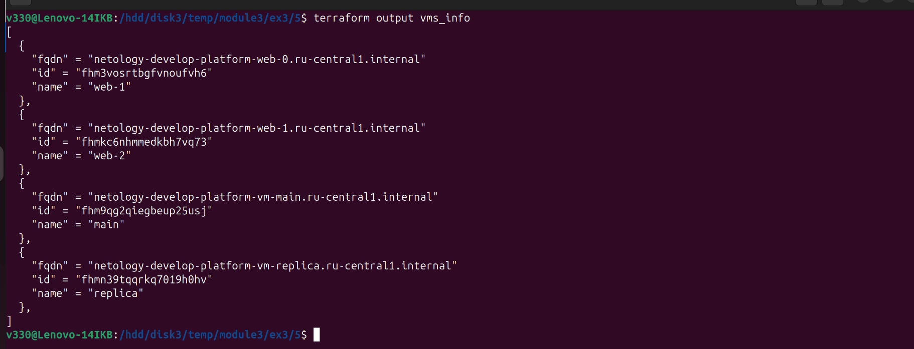

## Домашнее задание к занятию «Управляющие конструкции в коде Terraform»

***
### Задание 1  
Скриншот входящих правил «Группы безопасности» в ЛК Yandex Cloud  
  

Файлы и скриншоты по задаче можно посмотреть [здесь](1/)  

***
### Задание 2  
Скриншот виртуальных машин в ЛК Yandex Cloud  
  

Файлы и скриншоты по задаче можно посмотреть [здесь](2/)  

***
### Задание 3  
1.  
Скриншот виртуальных дисков в ЛК Yandex Cloud  
  

2.  
Скриншот ВМ "storage" в ЛК Yandex Cloud  
  

Файлы и скриншоты по задаче можно посмотреть [здесь](3/)  

***
### Задание 4  
Скриншот виртуальных машин в ЛК Yandex Cloud и получившегося файла  
  

Файлы и скриншоты по задаче можно посмотреть [здесь](4/)  

у меня каждое занятие выделено в отдельный репозиторий.  
В моем случае нет смысла выделять отдельную ветку terraform-03,  
так как результат проекта - это и есть основное содержимое репозитория.  

***
Файлы финального проекта можно посмотреть [здесь](src/)  

***
### Задание 5  
Скриншот вывода команды terrafrom output  
  

Файлы и скриншоты по задаче можно посмотреть [здесь](5/)  

***
### Задание 7  
Скриншот вывода команды terrafrom output  
  

Файлы и скриншоты по задаче можно посмотреть [здесь](7/)  

***
### Задача 9  
Скриншоты вывода команды terrafrom output  
  
...
  
...
  

Файлы и скриншоты по задаче можно посмотреть [здесь](9/)  

***
Файлы финального проекта можно посмотреть [здесь](src/)  

